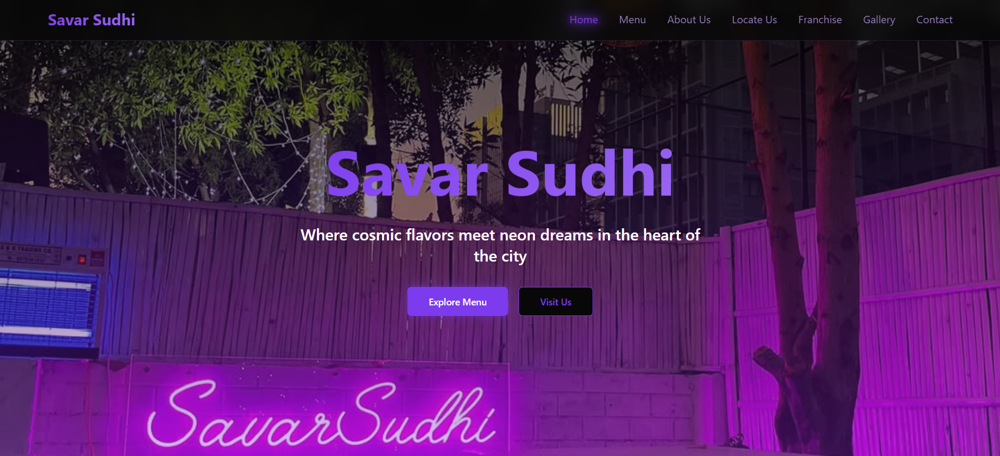
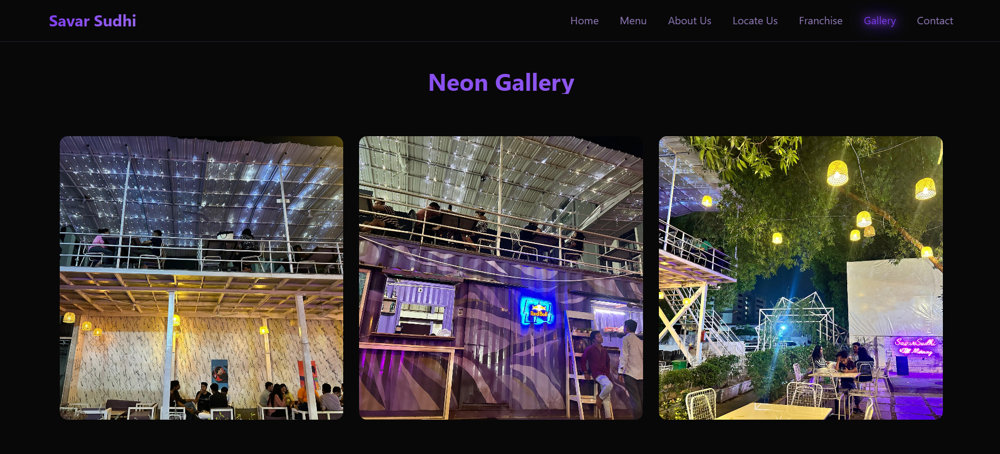
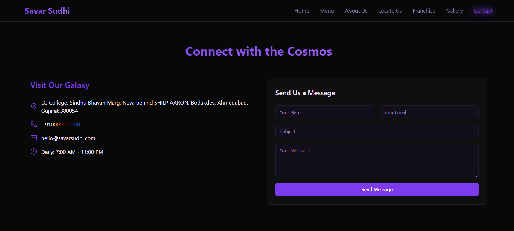

# Savar Sudhi Café — AI Generated Website 🌙

This is a fully AI-generated website for a late-night café in Ahmedabad, built using **Lovable AI Website Builder**.

## 🔗 Live Project
👉 [Visit Live Website](https://13f322ba-b87a-4e09-b9c7-d027dec7599a.lovableproject.com/)

---

## 💡 What’s Special?

- 100% built using **prompt engineering** (no manual coding)
- Fully functional and responsive design
- Custom pages: Home, Menu, About Us, Locate Us, Frenchise, Gallary, Contact
- Automated deployment via Lovable to GitHub

---

## 💬 Prompt Engineering Role

This site was built using carefully crafted prompts to:
- Define brand voice (late-night café vibe)
- Generate homepage structure, content & images
- Adjust color schemes and gallery layout
- Modify CTA buttons and contact info

> All UI and content changes were done through prompt iterations, not code edits.

---

## 🛠️ Tech Stack (Auto-generated via Lovable)

- Framework: Vite
- Language: TypeScript
- Library: React
- UI: shadcn/ui
- AI Builder: Lovable

---

## 🧠 AI Tools Used

| Tool | Role |
|------|------|
| **Lovable** | Website generation & deployment |
| **ChatGPT (optional)** | Prompt refinement |

---

## ✨ Learnings

- Prompt chaining to improve layout and flow
- Understanding how AI-generated UIs use shadcn, Vite, and Tailwind
- Site-ready output with 0% manual frontend coding

---

## 📸 Screenshots

### 🏠 Home Page  

### 📷 Gallery Section  

### 📍 Location Section  

### 🍽️ Contact Us Section  

---

## 📬 Contact

Built by Daksh Patel.  
Open to freelance AI-Prompting work and internships.

